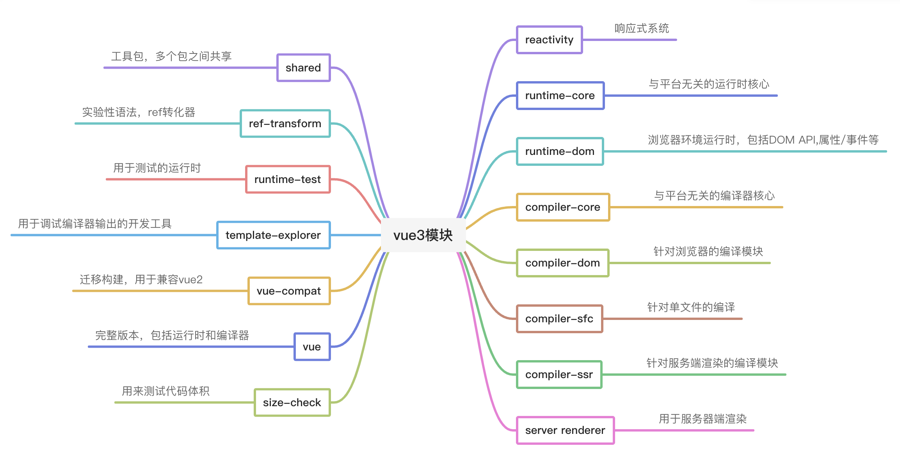

# 基于monorepo搭建vue3源码项目开发环境

本章学习的知识点：
- 掌握monorepo管理项目。
- 掌握pnpm依赖包管理。
- 了解esbuild打包。
- 了解vue3源码各个模块负责的功能。

## monorepo
### 什么是Monorepo？
monorepo是一种多包单一仓库的项目管理方式，顾名思义就是把多个模块/包放到一个仓库中管理的思维方式。

说到monorepo，就离不开对multirepo的讨论。multirepo就是传统的一个项目一个仓库, 是与monorepo完全相反的一种管理方式。

multirepo的优势是独立仓库，与其他仓库工作区隔离，项目管理简单，利于扩展；更好的权限控制。

multirepo主要缺点：
- 代码复用成本高：一个需求的更新，要经历依赖包的重新发布，然后其他项目更新依赖这样的流程，导致开发调试流程较繁琐。
- 版本管理：依赖包发布后，其他项目的依赖包更新不及时，版本不一致，可能会导致各种奇怪的报错。
- 项目构建流程重复：大部分项目的构建、部署流程大致一样，需要分别维护，增加了构建维护成本。

monorepo的实现解决了multirepo的一些痛点。

monorepo优点：
- 可见性：每个人都可以看到其他人的代码，更好的协作和团队贡献。
- 更简单的依赖关系管理：所有的模块都托管在同一个仓库中，共享依赖关系更简单。
- 唯一依赖源：每个依赖只有一个版本，没有版本冲突，没有依赖地狱。
- 一致性：执行代码质量标准和统一的风格会更容易。
- 统一的CI/CD：代码库的每个项目使用相同的CI/CD部署流程。
- 统一的构建流程：代码库中的每个应用程序可以共享一致的构建流程。

monorepo主要缺点：
- 性能差：单一仓库难以扩大规模，像git blame这样的命令可能会不合理的花费很长时间执行，IDE也变得缓慢，生产力受到影响。
- 大量的数据：单一仓库可能要处理大量的数据和提交。
- 所有权控制：对代码的权限控制更具挑战性。

**monorepo不仅仅是一种代码库策略，也是公司对工作流程的一种决策。**

**monorepo本身不是工具，而是对项目的一种管理方式。需要一套完善的工程化工具来支持monorepo。**

### Monorepo的实现方案

1. [lerna](https://lerna.js.org/docs/introduction)

2. [nx](https://nx.dev/getting-started/intro)

3. [pnpm](https://pnpm.io/)

## pnpm
pnpm的几个特点：
1. pnpm的目的是节省磁盘空间并提升安装速度。
2. 创建非扁平的node_modules目录。
  pnpm安装的包及其依赖项被下载到.pnpm中,node_modules根目录下仅暴露项目直接依赖的包。
  npm安装的包及其依赖项都被下载到node_modules的根目录下,属于同级关系。
3. 使用符号链接的node_modules结构。

## Vue3项目模块介绍



## 搭建Vue3源码项目开发环境

vue3中，使用 pnpm workspace 搭建monorepo环境。npm不支持monorepo。

### 全局安装pnpm
```sh
# 全局安装pnpm, mac系统:命令行前面添加sudo;当前pnpm版本:7.2.1
npm install pnpm -g 
```

### 初始化package.json配置文件

创建monorepo文件夹作为项目目录名，初始化配置文件
```sh
# 初始化package.json配置文件
pnpm init 
```
### 创建packages目录

该目录下管理vue3开发的所有模块。

### 配置workspace

新建pnpm-workspace.yaml文件
```yaml
packages:
  - 'packages/*'
```
将packages下的所有目录都作为包进行管理。到这里monorepo环境就搭建好了!

### 创建.npmrc文件
```npmrc
shamefully-hoist = true
```
在创建npmrc之前，可以尝试安装vue3,执行pnpm install vue,命令行出现以下提示：
> Running this command will add the dependency to the workspace root, which might not be what you want - if you really meant it, make it explicit by running this command again with the -w flag (or --workspace-root). If you don't want to see this warning anymore, you may set the ignore-workspace-root-check setting to true.

大概意思是pnpm会将依赖添加到根目录，如果确定，在命令行后面添加-w来执行。此时我们再次执行pnpm install vue -w 来安装vue3。

依赖下载后打开node_modules可以发现，只有一个vue模块，其他依赖的模块都在.pnpm中管理。这是pnpm包管理的优化，为了解决幽灵依赖问题。

如果我们不想要这种方式，想和npm效果保持一致，这里可以配置shamefully-hoist = true，添加羞耻的提升可以将Vue3所依赖的模块提升到node_modules中。

### TypeScript类型校验

**下载依赖**
| 依赖  | 说明 |
| ---------- | ----------------------- |	
| typescript | 支持typescript           |
| minimist	 | 命令行参数解析            |
| esbuild	 | 开发环境打包           |


```sh
pnpm install typescript minimist esbuild -w -D
```
**初始化tsconfig.json文件**

根目录下添加tsconfig.json文件，执行下面一条命令即可。
```sh
pnpm tsc --init
```
**添加tsconfig.json 常用配置**
```json
{
  "compilerOptions": {
    "outDir": "dist", // 输出的目录
    "sourceMap": true, // 采用sourcemap
    "target": "es2016", // 目标语法
    "module": "esnext", // 模块格式
    "moduleResolution": "node", // 模块解析方式
    "strict": false, // 严格模式
    "resolveJsonModule": true, // 解析json模块
    "esModuleInterop": true, // 允许通过es6语法引入commonjs模块
    "jsx": "preserve", // jsx 不转义
    "lib": ["esnext", "dom"], // 支持的类库 esnext及dom
  }
}
```

### 创建模块

在packages目录下先创建两个模块：reactivity响应式模块、shared共享工具库模块。
每个包的入口统一为src/index.ts

**reactivity/package.json 如下：**

```
{
  "name": "@vue/reactivity",
  "version": "1.0.0",
  "main": "index.js",
  "module":"dist/reactivity.esm-bundler.js",
  "unpkg": "dist/reactivity.global.js",
  "buildOptions": {
    "name": "VueReactivity",
    "formats": [
      "esm-bundler",
      "cjs",
      "global"
    ]
  }

  "keywords": [],
  "author": "",
  "license": "ISC"
}
```

**shared/package.json 如下：**

```
{
  "name": "@vue/shared",
  "version": "1.0.0",
  "main": "index.js",
  "module": "dist/shared.esm-bundler.js",
  "buildOptions": {
    "formats": [
        "esm-bundler",
        "cjs"
    ]
  }
}

```
**shared/src/index.ts 添加代码：**

```
export const isObject = (value) => {
    return typeof value === 'object' && value !== null;
}
```

**在reactivity包内引入shared包方法需要在tsconfig.json中配置包路径,避免ts类型警告:**

```
{
  ...
  "baseUrl": ".",
  "paths":{
    "@vue/*":["packages/*/src"]
  }
}
```

**reactivity模块内，将依赖包@vue/shared下载到reactivity模块内，可执行如下命令：**
```
pnpm install @vue/shared@workspace --filter @vue/reactivity

```

### 开发环境配置
开发环境使用esbuild打包工具。
1. 创建打包脚本：创建scripts/dev.js文件
```
const {resolve} = require('path')
const {build} = require('esbuild')
// 获取命令行参数
const args = require('minimist')(process.argv.slice(2))
// console.log(args,'args') // { _: [ 'reactivity' ], f: 'global' }

// 打包目标
const target = args._[0] || 'reactivity'
// 目标文件格式
const format = args.f || 'global'

//入口文件
const entry = resolve(__dirname,`../packages/${target}/src/index.ts`)

// 打包的模块的package.json
const pkg = require(resolve(__dirname,`../packages/${target}/package.json`));

// iife 自执行函数：(function(){})()
// cjs common.js规范
// esm es6Module

// 打包后输出的文件格式
const outputFormat = format.startsWith('global') ? 'iife': format==='cjs' ? 'cjs': 'esm'
// 打包后输出的文件
const outfile = resolve(__dirname,`../packages/${target}/dist/${target}.${format}.js`)

// console.log(outfile,entry,outputFormat,format)

// 天生就支持ts
build({
    entryPoints: [entry], // 打包入口文件
    outfile, // 打包输出文件
    bundle: true, // 把所有的包全部打包到一起
    sourcemap: true, // 是否生成map文件
    format: outputFormat,// 输出的格式
    globalName: pkg.buildOptions?.name, // 打包的全局的名字
    platform: format === 'cjs' ? 'node' : 'browser', // 平台
    watch: { // 监控文件变化
        onRebuild(error) {
            if (!error) console.log(`rebuilt~~~~`)
        }
    }
}).then(() => {
    console.log('watching~~~')
})
```
2. 创建打包命令
package.json 文件配置：
```
  ...
  "scripts": {
    "dev":"node scripts/dev.js reactivity -f global"
  },
```
### 验证测试
reactivity/dist/下创建index.html文件，引入打包后的reactivity.global.js文件

```
<!DOCTYPE html>
<html lang="en">
<head>
  <meta charset="UTF-8">
  <meta http-equiv="X-UA-Compatible" content="IE=edge">
  <meta name="viewport" content="width=device-width, initial-scale=1.0">
  <title>reactivity</title>
</head>
<body>
  <script src="./reactivity.global.js"></script>
</body>
</html>
```
浏览器打开index.html，控制台查看输出的数据，有数据即正常访问。

至此，基于monorepo构建的vue3项目开发环境基本搭建完成。

**参考**

[What is monorepo? (and should you use it?)](https://semaphoreci.com/blog/what-is-monorepo)

[5分钟搞懂Monorepo](https://www.jianshu.com/p/c10d0b8c5581)
